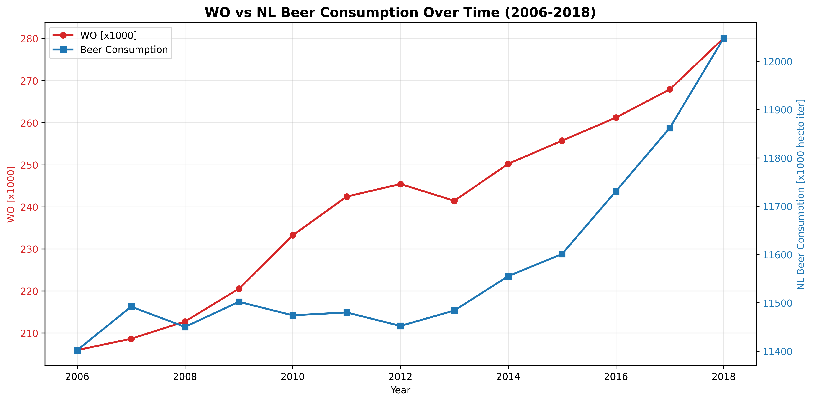

# Computational Scientist's Toolbox Assignment

**Student ID:** 16124510

## Paper Titles

- **MCC Van Dyke et al., 2019**: "Fungal wars: basidiomycete battles in wood decay"
- **JT Harvey, Applied Ergonomics, 2002**: "An analysis of the forces required to drag sheep over various surfaces"
- **DW Ziegler et al., 2005**: "The neurocognitive effects of alcohol on adolescents and college students"

## Data Visualization

### Interpretation

The plot shows the relationship between WO (wine consumption?) and NL Beer consumption over the years 2006-2018. From the data, we can observe:

- Both WO values and beer consumption show a general increasing trend over time
- The correlation appears to be positive, suggesting that as WO increases, beer consumption also tends to increase
- However, correlation does not imply causation - there may be other underlying factors influencing both variables
- The steady increase in both metrics could reflect broader economic or demographic trends in the Netherlands during this period
